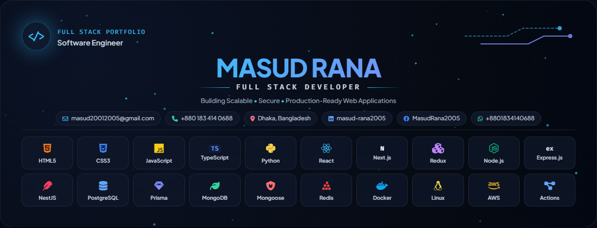

  

<h1 align="center">
  Hey there, I'm Masud Rana
  
</h1>

<h3 align="center">Full Stack Developer | React • Next.js • Node.js • NestJS • PostgreSQL</h3>

## 🚀 About Me

- Full Stack Developer passionate about building scalable, secure, and production-ready web applications.
- Build responsive and modern user interfaces with React, Next.js, Redux Toolkit, and Tailwind CSS.
- Develop robust backend systems using Node.js, Express.js, NestJS, TypeScript, and JavaScript.
- Design efficient and scalable databases with PostgreSQL, Prisma, MongoDB, Mongoose, and Redis.
- Focus on REST APIs, authentication, authorization, caching, rate limiting, real-time communication, and clean architecture.
- Deploy and maintain applications using Docker, Linux, Nginx, AWS, VPS, GitHub Actions, and CI/CD pipelines.
- Currently learning Generative AI with Python, RAG, n8n, LLM applications, and AI automation workflows.

## 💼 Experience

### Executive Full Stack Developer
**Softvence Agency** · Jul 2026 – Present

- Promoted from Backend Developer to Executive Full Stack Developer.
- Build scalable full stack applications with React, Next.js, NestJS, and PostgreSQL.
- Analyze client requirements, design databases, and develop production-ready solutions.
- Implement real-time features with Socket.IO and deploy applications using Docker and CI/CD.

### Backend Developer
**Softvence Agency** · Nov 2025 – Jun 2026

- Developed secure REST APIs using Node.js, Express.js, NestJS, and TypeScript.
- Built authentication, payment, caching, and database-driven backend services.
- Optimized PostgreSQL, Prisma, MongoDB, Redis, and collaborated across cross-functional teams.

## 🛠️ My Tech Stack

### Programming Languages

  
  
  

### Frontend Development

  
  
  
  
  
  
  
  
  
  
  
  
  

### Backend Development

  
  
  
  
  
  
  

### Database & ORM

  
  
  
  
  

### Generative AI

  
  
  

### Payment Systems

  
  
  
  

### DevOps & Cloud

  
  
  
  
  
  
  
  

### Tools & Platforms

  
  
  
  
  
  
  
  
  
  
  
  
  
  
  
  
  
  

## 📊 GitHub Stats

  

  

  

  

  

## 🌐 Let's Connect

  
  
  
  

### Thanks for visiting my GitHub profile! 🚀

*Let's build something amazing together.*

